# Bitwarden 网页版

---


Bitwarden 不怎么特别，但它拥有一个密码管理器应有的所有安全性和功能。It just Works.

开发者：Bitwarden, Inc. | [官方网站](https://bitwarden.com) | [源代码](https://bitwarden.com/open-source/)  
客户端 [GPLv3](https://github.com/bitwarden/browser/blob/master/LICENSE.txt), 服务端 [AGPLv3](https://github.com/bitwarden/server/blob/master/LICENSE_AGPL.txt) 和 [Bitwarden EULA](https://github.com/bitwarden/server/blob/master/LICENSE_BITWARDEN.txt) | [服务条款](https://bitwarden.com/terms/) | [隐私政策](https://bitwarden.com/privacy/)

---

## 回顾

[上一章](../Passwords.md)中 *noarch* 定义了一个合格的密码管理器，我们将要介绍的 Bitwarden 就是符合标准的一个。

它使用 [AES-256](https://en.wikipedia.org/wiki/Advanced_Encryption_Standard) 加密你的密码库，并将你的主密码使用加盐的 [PBKDF2 SHA-256](https://en.wikipedia.org/wiki/PBKDF2) 形式存储，以保证密码库的**零访问**。零访问意味着你的密码库只在客户端被解密，就连 Bitwarden 的员工或可能搜查 Bitwarden 的警方都无法通过正常方式获取你的密码。

最重要的 - 它几乎全由自由软件组成。得益于此，如果你不信任 Bitwarden 官方云，你甚至可以自己搭建 Bitwarden 服务器，自己管理自己的数据；不过 *noarch* 不会在此教你如何自建 Bitwarden 服务器。

## 可能的疑问

本章要讲述的是 Bitwarden 的网页版密码库。

你可能会好奇，既然是网页，那么为什么 Bitwarden 说他们不能访问你的密码呢？

答案是 [Javascript](https://en.wikipedia.org/wiki/JavaScript) 的力量。Javascript 是网页在你浏览器中运行的“小程序”，浏览器会自动加载它们并运行。理论上，它们可以做任何需要“安装”的程序可以做的事，而不需要让你“安装”。

其实，`privacy.noarch` 就在使用 Javascript. 试着点击页面左上角的 <i class="fa fa-bars" aria-hidden="true"></i> ，你可以看到本书菜单的打开和关闭。得益于 Javascript, 这个菜单可以被显示或隐藏，并且开关的行为会展示动画。没有 Javascript, 这个菜单的开关动画需要在 `privacy.noarch` 的服务器中渲染并传输；对于 `privacy.noarch` 目前 (2020 年) 的浏览量而言可能可行，而对于 Google 等巨型服务，为数亿用户每人渲染视觉效果显然不现实。

Bitwarden 网页版在打开时会加载对应的 Javascript 程序，并且下载你的密码库。解锁和操作这个密码库的行为完全被已经加载到本地的 Javascript 完成，因此你不需要担心你的密码库未加密经过互联网传输。

## 注册帐号

Bitwarden 的注册非常简单明了。首先我们打开 Bitwarden 的官网 [bitwarden.com](https://bitwarden.com):

> 如果你看到下方的 Cookie 提示，你可以直接点击“拒绝”。拒绝后 Bitwarden 网页版不会留下跨站 Cookie.

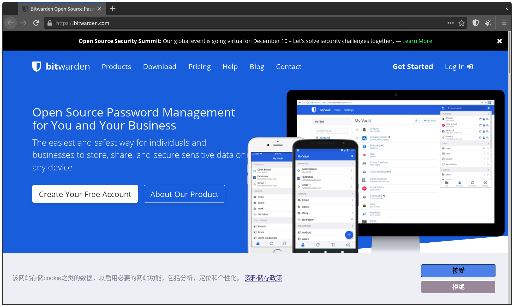

别被这个网页上的英文吓跑。虽然 Bitwarden 官网只有英文，但接下来我们操作的密码库具有中文翻译。

点击右上角的 **Get Started** 来注册帐号，你会被带到一个表格：

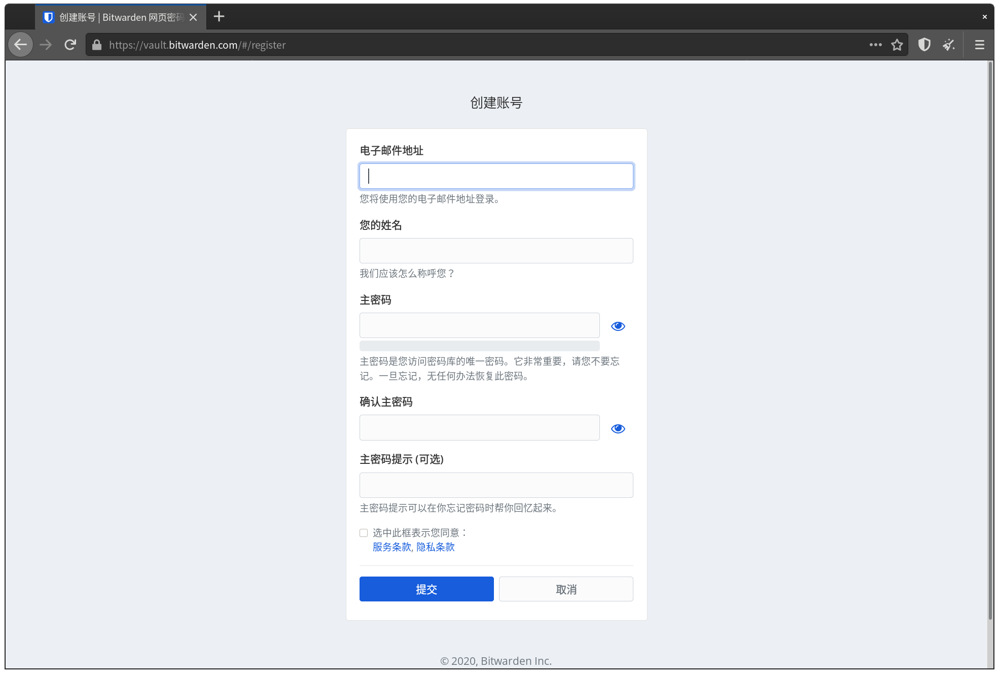

就像注册任何其它帐号一样，填写你的邮箱地址和名字。名字可以使用假名，就像这样：


不过**等一下**。你可能现在就在犯一个错误：**在密码管理器上使用你之前用过的密码。**

***noarch* 强烈反对这种行为**。

请当场想出一个够强的密码，它最好有至少 15 位，拥有大小写字母、数字和符号...

> *到底怎么做啊！我想不出来！*

### 人脑密码生成器

在我们把生成密码这件事交给密码管理器前，请想想你之前用过的密码。

*noarch* 就用过自己的名字首字母和生日；现在想起来最可怕的一个是直接使用用户名，加上其中几个字符用 [Leet (1337)](https://en.wikipedia.org/wiki/Leet) 替换成对应的符号和数字。

请别这样做。如果你使用这些能联系到个人身份，或是关于你的，长久有效的信息，例如 ~~`n0@rcH1sn0tgaY`~~, 充分了解你的人将能猜出这个密码，或黑客可以通过你的密码获取你的相关信息。例如上面的密码 ~~`n0@rcH1sn0tgaY`~~ 看起来很强，但了解 *noarch* 的人有一定的可能性会猜出它来。

所以 *noarch* 想要分享一下自己的密码“生成”思路，它用来“生成”你的密码管理器主密码：

> <i class="fa fa-info-circle" aria-hidden="true"></i> 这只是 *noarch* 的个人做法，提供给那些根本想不出来的读者。如果你有更好的主意，*noarch* 将会非常感谢你的[贡献](/CONTRIBUTING.md)。

0. 像 *noarch* 之前讲的，避开任何自己的长期信息。任何“最喜欢的”也要避开。
1. 想想自己**最近**做的事情、读的书、看的电影或是玩过的游戏。
2. 如果适用，你也可以想想这些书、游戏或电影中发生的事。
3. 把它们写下来。*noarch* 最近在读 [Richard Stallman](https://en.wikipedia.org/wiki/Richard_Stallman) 的传记 [*Free as in Freedom*](https://en.wikipedia.org/wiki/Free_as_in_Freedom).
4. 用 [1337](https://en.wikipedia.org/wiki/Leet) 编码它。这样它就包含了数字和符号。
5. 加上一些非常易变的数字。比如你“生成”密码时的时间，或是你现在在使用的某个软件版本号。*noarch* 在“生成”这个密码时的时间是下午 5:40.
6. 把它夹在第4步得出的内容中间某个位置。

经过这样一个步骤，*noarch* 写出了一个这样的密码：

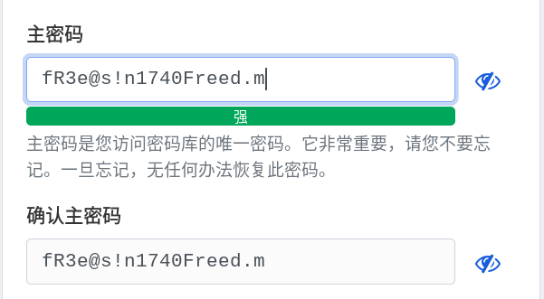

如果你有任何其它主意，你还可以把它和 *noarch* 的方法结合在一起！例如你还可以把最后的 `Freed.m` 倒序成 `m.deerF`, 得出最终结果 `fR3e@s!n1740m.deerF`. 现在你就得到了一个基本没人猜得出来，并且机器也难以爆破的主密码，用于加密你的 Bitwarden 密码库。

> 别担心，*noarch* 当然不会将上述密码进行实际使用，你也绝对不要真用上述的示例密码。

最后，你可以选择提供一个密码提示；当你真的忘记密码时，你可以请求 Bitwarden 将它发送到你的邮箱里。

> <i class="fa fa-exclamation-triangle" aria-hidden="true"></i> 密码提示是明文存储的，并且另一款密码管理器 [LastPass 曾经发生的数据泄露](https://www.pcworld.com/article/2936621/the-lastpass-security-breach-what-you-need-to-know-do-and-watch-out-for.html)中就包含密码提示。因此，请不要在内填写有关自己的信息。例如 *noarch* 简单地在这里写了 `GNU`, 因为 `GNU` 就是密码中提到的“自由软件”概念开创者之一。

### 记住密码

如果你从来没有尝试记忆过 `fR3e@s!n1740Freed.m` 这么强的密码，那么你可能会在创建完帐号后一瞬间就忘掉你刚才创建的密码。

不过，既然我们使用的密码是有规律的，那么经过一定的练习，你一定可以记住。

你现在可以将你的主密码写在一张纸上，然后放在一个安全的地方，就像你原来用小本子记密码一样。直到你能不假思索输入这个密码为止，你都会需要参考它，以防止你在这段学习期间内忘掉密码。

> <i class="fa fa-exclamation-triangle" aria-hidden="true"></i> 请确保**这张纸**可以被轻易摧毁。因此，也请避开你“不舍得”摧毁的记事本。严禁使用可擦笔，因为可擦笔即使擦掉后也会留下痕迹，或是被冰箱冷冻层的温度复原。

在记住后，请**将纸张摧毁到至少纤维级别**。常见的方法有烧毁或泡水捣碎。

> <i class="fa fa-bomb" aria-hidden="true"></i> 在学习区间内，严禁使用任何电子方式存储你的主密码。这样做会使密码管理器失去其意义。

当你想好并写下了密码，你就可以**阅读并同意** Bitwarden 的[服务条款](https://bitwarden.com/terms/)和[隐私政策](https://bitwarden.com/privacy/)了。


最后，点击“提交”来注册。

## 登录、验证，并和密码保险箱说声好

在点击“提交”后，你会被带到登录界面。你需要在这里再次输入你的密码：


> <i class="fa fa-exclamation-triangle" aria-hidden="true"></i> 因为密码管理器的安全特性，Bitwarden 不像许多服务一样可以“记住密码”。你只能选择“记住邮件”，并手工输入密码。如果你不想每次访问密码库都输入密码，你可以安装 [Bitwarden 客户端或浏览器插件]()。

登录后，你就进入了 Bitwarden 密码库。

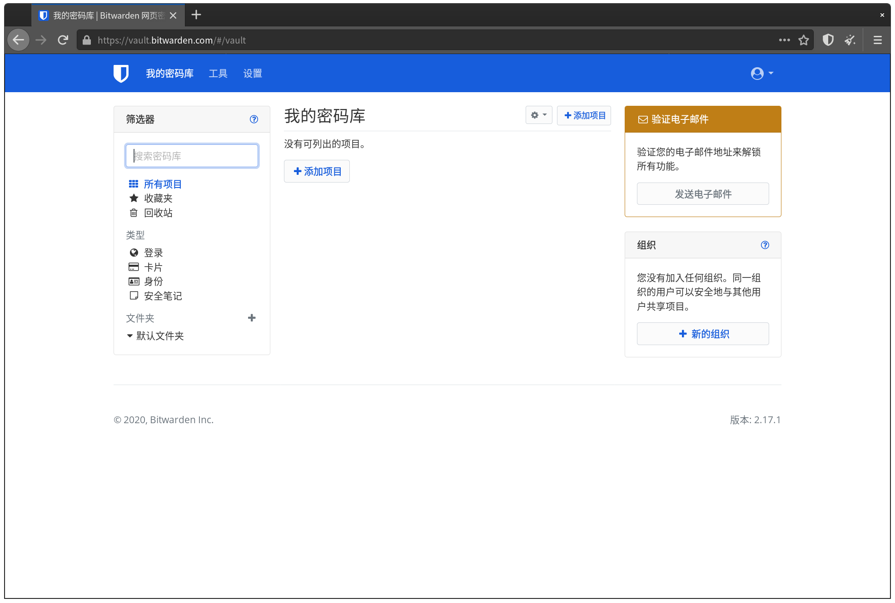

在我们开始将密码放入 Bitwarden 之前，你可能注意到了右上角的“验证电子邮件”提示。我们现在就来解决这个问题。

打开你用来注册 Bitwarden 的电子邮件账户；你应该会看到一个“欢迎”邮件。

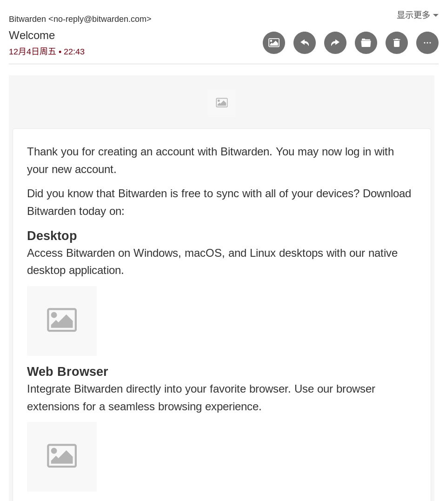

现在回到 Bitwarden 密码库，在“验证电子邮件”里点“发送电子邮件”。


然后你会在邮箱里看到一封用于验证的 "Verify Your Email" 邮件，其中包含一个 "Verify Email Address Now" 按钮。


> <i class="fa fa-info-circle" aria-hidden="true"></i> 取决于你的邮件客户端安全设置，这封邮件可能会像上图一样无法正常加载。不用担心，这个按钮能在不加载远程内容的情况下工作。
>
> *noarch* 推荐像 [Thunderbird]() 或 [Tutanota]() 这样**拦截远程内容**的邮件客户端 / 提供商，它们能帮你阻挡大部分来自邮件的恶意软件，并防止邮件发送者通过远程请求追踪你。

在**确认来源地址**是 `no-reply@bitwarden.com` 后，点击这个按钮，你会被带到一个有提示的登录页面。


在这里再次登录，然后你就可以正式开始使用 Bitwarden 了。

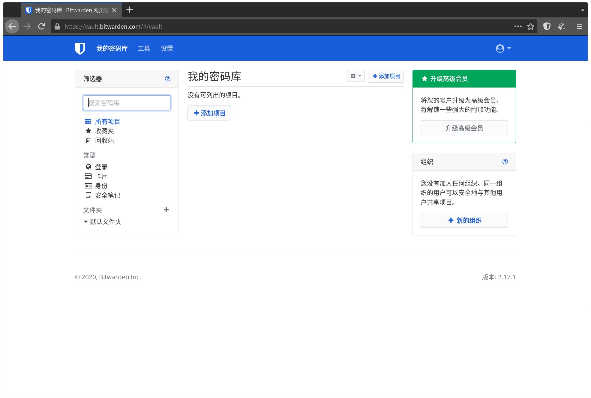

## 添加你的第一条密码

在 Bitwarden 存储密码同样简单明了。

不过，如果你在密码管理器存储以前重复使用的密码，它将失去意义。所以 *noarch* 将在这演示为 Tutanota 邮箱使用 Bitwarden 生成并保存密码。

要让 Bitwarden 为你保存密码，点击“添加项目”。


然后你可以在这填写你的帐号名称（服务）、用户名/邮箱，以及登录时的网址 (URI)。

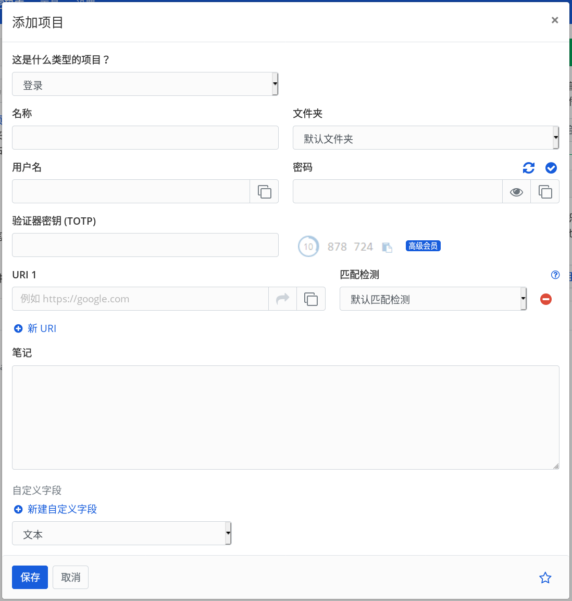

虽然 URI 是可选的，但 *noarch* 建议你填写它。URI 有两个用途：

0. 用于获取这个帐号的图标，并展示在 Bitwarden 密码库内。
1. 用于自动填写。这个会在你使用 [Bitwarden 浏览器插件或手机应用]()时有用。

除了密码之外的字段填完后是这样：

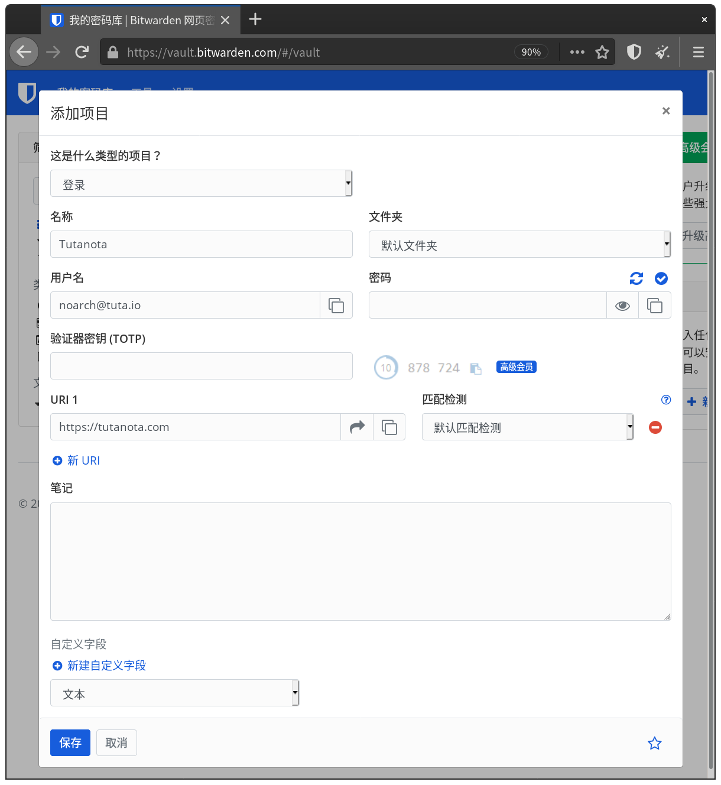

接下来你就可以点击“密码”字段上方的 <i class="fa fa-refresh" aria-hidden="true"></i> 按钮来生成密码。生成的密码会自动填写到“密码”字段里。


点击 <i class="fa fa-eye" aria-hidden="true"></i> 可以用明文查看密码，再次点击 <i class="fa fa-eye-slash" aria-hidden="true"></i> 可以将其恢复到隐藏状态。


点击 <i class="fa fa-files-o" aria-hidden="true"></i>，这个密码就会被复制到剪贴板。

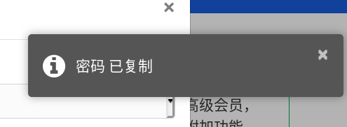

接下来，你需要登录你要修改密码的帐号，然后找到修改密码的入口：

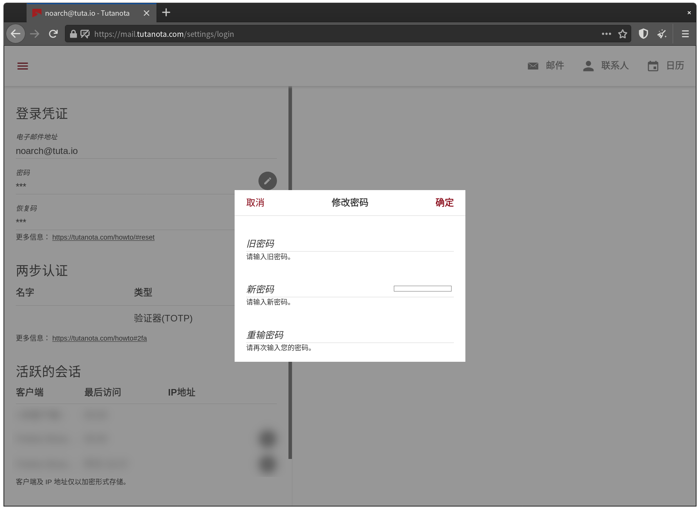

输入你的旧密码，然后粘贴新密码。只是一个普通的密码修改过程。

修改完密码后，回到 Bitwarden, 在密码表单点击“保存”。你会被带回“我的密码库”。

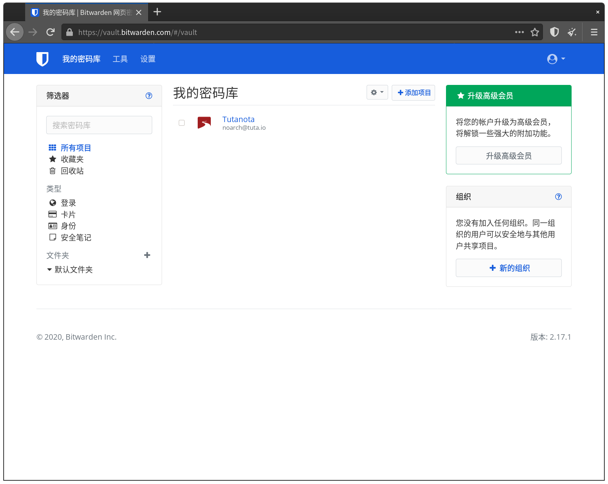

## 读取密码管理器中的密码

在“我的密码库”中点击对应帐号的项目，你就可以查看刚刚在编辑的表单，在其中进行任何操作。

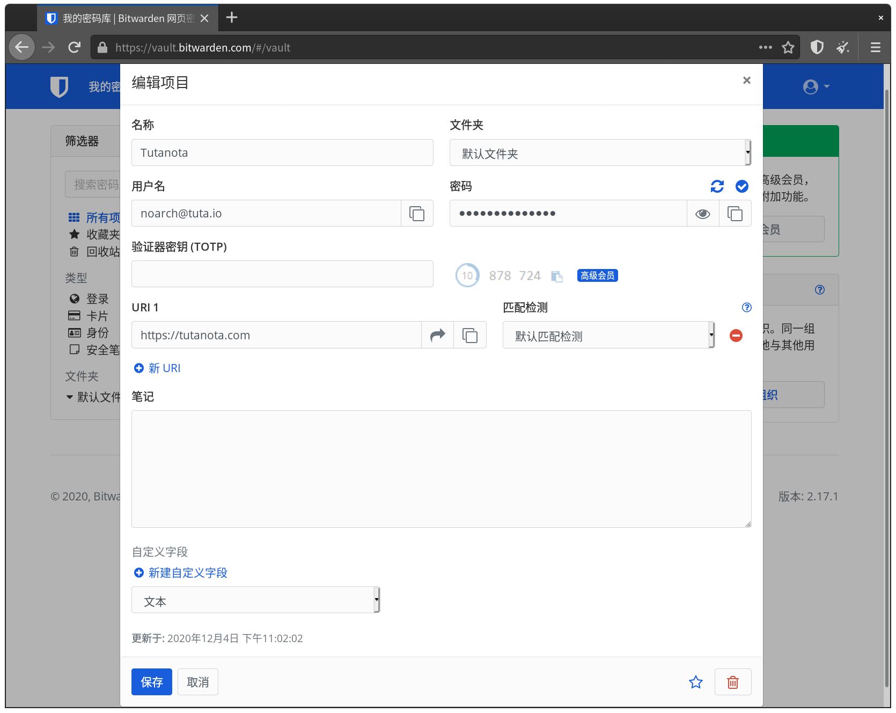

以登录账户为例，在“密码”字段点击 <i class="fa fa-files-o" aria-hidden="true"></i>，然后在要登录服务的密码框粘贴。

如果你有太多账户，你可以使用左侧的“筛选器”。使用筛选器后，只有符合搜索结果的项目会显示在右侧。

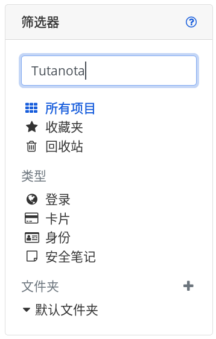

### 登录 Bitwarden

当你关闭浏览器、闲置一段时间，或是手动退出 Bitwarden, 你将需要重新登录密码库。

#### 完全关闭浏览器

如果你完全关闭浏览器，你需要重新登录 Bitwarden. 访问 [bitwarden.com](https://bitwarden.com), 然后 "Log In":


你就可以输入你的主密码，然后登录进入密码库了。

#### 锁定

当你打开 Bitwarden 网页密码库**一段时间闲置不用**（默认 15 分钟），Bitwarden 会自动“锁定”：

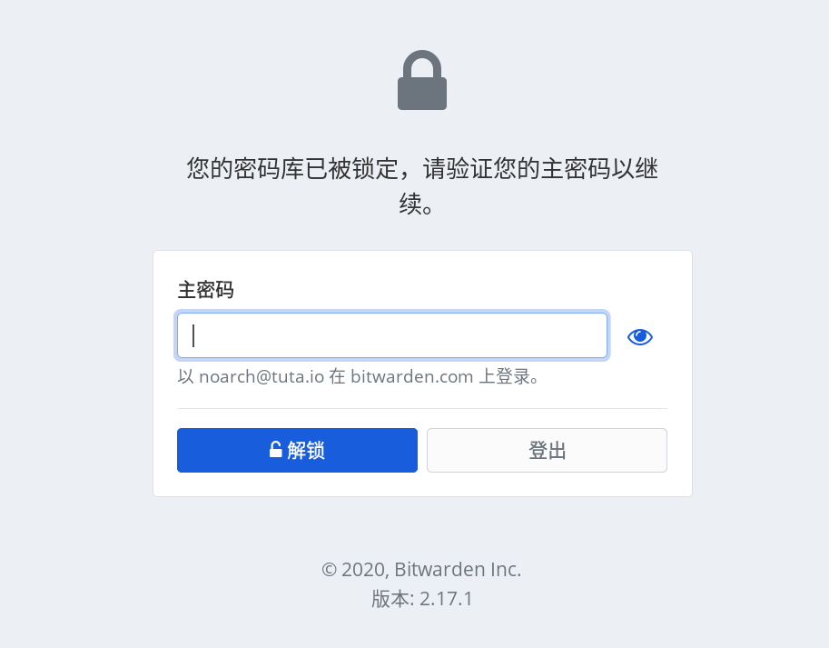

同样，输入密码然后“<i class="fa fa-unlock-alt" aria-hidden="true"></i> 解锁”就可以了。

---

## 进阶功能

下面是一些 *noarch* 认为一般人可能不会用到的功能，但也会在这做介绍。

### 存储信用卡、身份、以及笔记

Bitwarden 还可以用来存储信用卡和身份。搭配 [Bitwarden 浏览器插件或手机应用]()使用时，Bitwarden 可以帮你自动填写这些表单。

添加它们的方法和添加密码类似，只不过需要填写的信息不同。你可以通过“这是什么类型的项目？”在这些模式中切换。

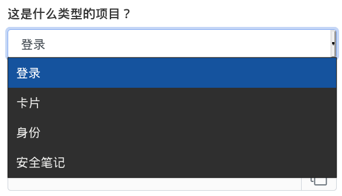

作为例子，下面是 Bitwarden 存储信用卡信息的表单。

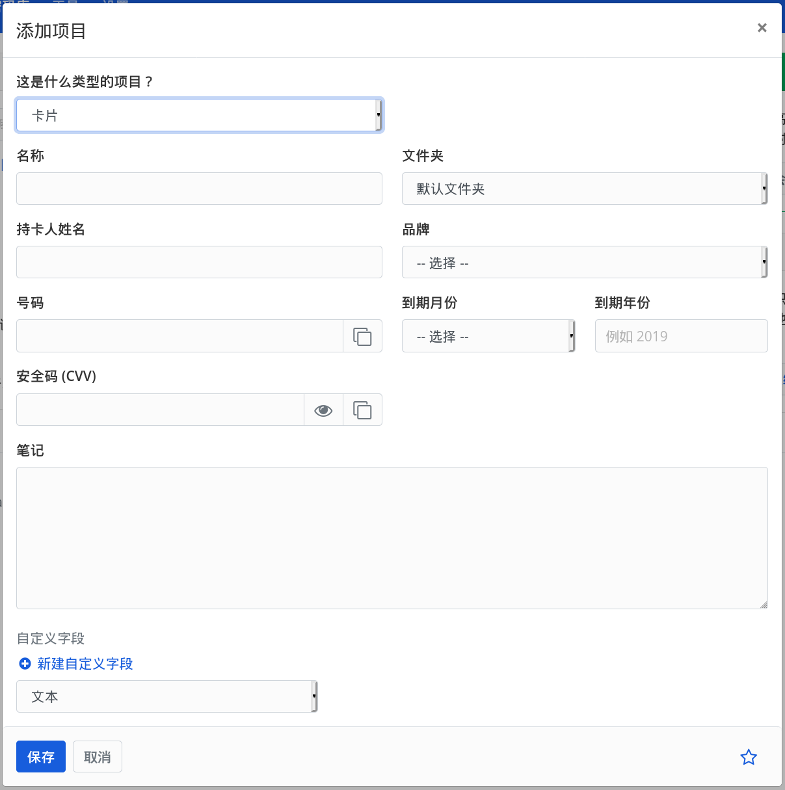

这些其它类型的表单使用与密码表单相同的方式加密，因此 Bitwarden 无法将你存储在内的信用卡或护照信息作为它用。

### 修改密码生成器强度

当你在 Bitwarden 密码表单中点击 <i class="fa fa-refresh" aria-hidden="true"></i> , Bitwarden 默认生成长度为 14 位，包含数字与大小写字母的密码, 就像这样：

```
WkRUdb6LRqF8sC
```

Bitwarden 这样做是为了保证最大兼容性，因为有些服务不支持密码中包含符号。

不过 *noarch* 以及一些其它密码管理器，例如 KeepassXC 认为这样生成的密码强度不够高。因此，如果你有需要，可以调节 Bitwarden 密码生成器参数。

在 Bitwarden 密码库顶栏点击 `工具 -> 密码生成器`，你应该能看见一个专门的密码生成器：

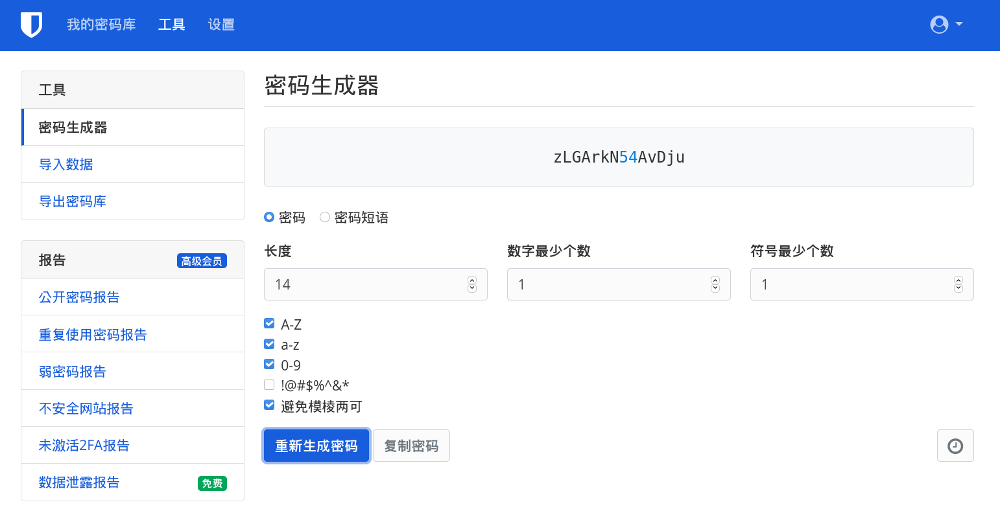

在这里你可以调节密码类型、长度、包含的字符集以及每种字符最小个数。*noarch* 建议你将密码生成器调成这样。现在它长度为 24 位，包含完整的 `[A-Za-z0-9!@#$%^&*]`.

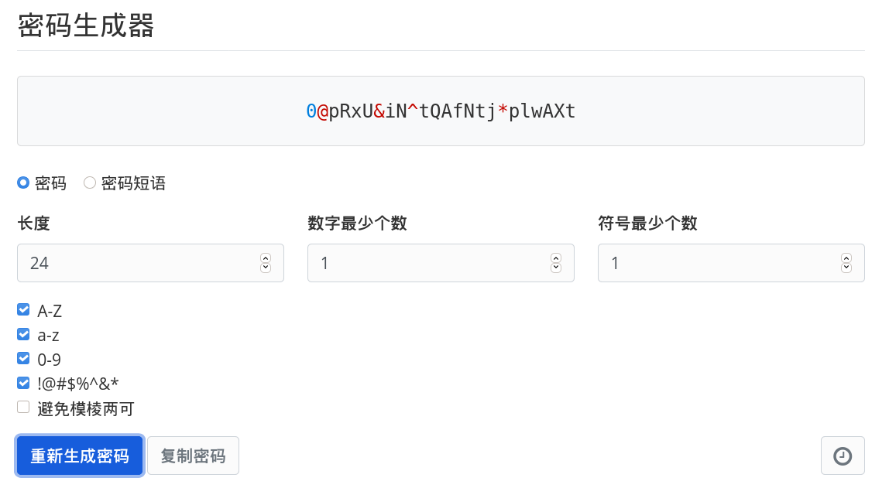

### 导入密码库

如果你之前在使用其它“密码管理器”，例如 Chrome 浏览器的“保存密码”功能，你可以将保存在那里的密码导入 Bitwarden.

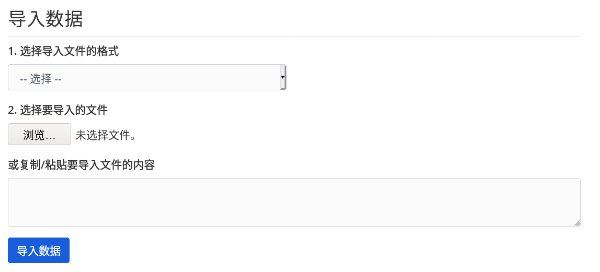

在 Bitwarden 密码库 `工具 -> 导入数据`，你可以选择对应的导入来源。Bitwarden ~~贴心地~~ 为不同来源提供了英文教程。


以 Chrome 为例，在选择后，Bitwarden 会给你展示对应的教程链接。


跟随 Bitwarden 提供的教程，你就可以从各大密码管理器或“密码管理器”无痛换到 Bitwarden 了。

### 导出密码库

如果你想从 Bitwarden 换到其它密码管理器，你也可以这么做：

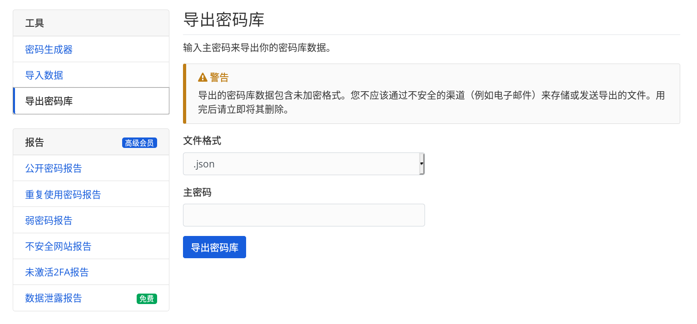

Bitwarden 可以将你的密码库导出为 `json` 或 `csv` 格式，它们可以进一步被导入到 [KeepassXC]() 或任何支持导入这些格式的密码管理器。

### 修改账户设置

如果你不慎泄露了主密码 (*noarch* 希望你绝对不要)，或你的邮箱被盗，在伤害发生前请立刻在 Bitwarden 内修改对应的设置。

你可以进入 `设置 -> 我的账户` 修改这些设置。无论是修改邮箱地址或是主密码，你都需要确认当前的主密码。

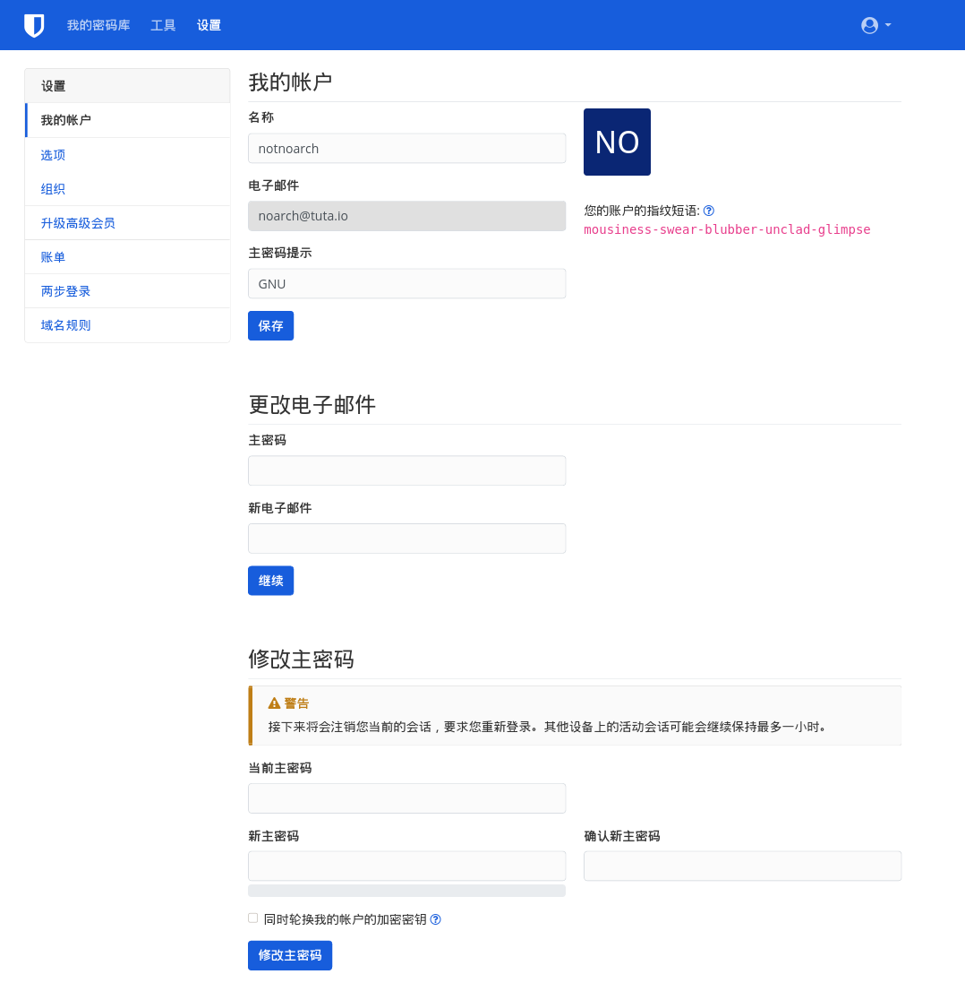

## 总结

你现在应该能够顺利使用 Bitwarden 管理你的密码了。

虽然目前你的 Bitwarden 密码库内只存有一个帐号，不过你可以在之后使用某个没有存入 Bitwarden 的帐号时下意识将它存入 Bitwarden 并**通过上述方法改密码**。

**密码管理器的使用时间越久，它对你提供的便利和安全性越大**；*noarch* 希望你不要被刚开始的麻烦吓跑，因为它在长期使用后是你的得力助手。
